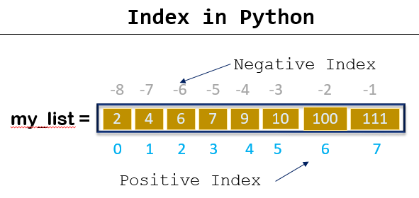

# Lists


## What is List?

In Python, the "list" data type is a data structure used to store and access multiple values. Lists can contain different data types (e.g. integers, strings , other lists, etc.) and these values ​​can be accessed through indexes.

You can use square brackets \[] to create a list. For example:

```
my_list = [1, 2, 3, 4, 5]
```

This example creates a list containing the numbers 1 through 5. Since lists are mutable, their contents can be changed at later stages of the program.

## How do we create a list?

To create a list in Python, you need to use square brackets \[]. Here are examples of different ways to create list:

**1.Creating an empty list:**

```
empty_list = []
```

#### 2.Create a list with elements:

```
numbers = [1, 2, 3, 4, 5]
fruits = ["apple", "banana", "orange"]
mixed_list = [1, "apple", True, 3.14]
```

#### 3.Using the list() Constructor:

```
numbers = list([1, 2, 3, 4, 5])

type(numbers)
print(numbers)

# From a tuple
a = list((1, 2, 3, 'apple', 4.5))  

print(a)
```

#### 4. Using range () function:

```
number_range = list(range(1, 6)) 
# List containing numbers from 1 to 5 (not including 5)
```

#### 5.Using List Comprehension:

```
squared_numbers = [x**2 for x in range(1, 6)]  
# List containing squares of numbers from 1 to 5
```

#### 6.Creating a List with Repeated Elements Using the \* Operator:

```
repeated_list = ["hello"] * 3  
#List containing "hello" three times.
```

These examples show how you can create lists in different ways. Since lists are mutable, you can update their contents later.

### What is nested list?

Nested list is a list structure that contains other lists inside a list. This is used to organize data hierarchically and create more complex data structures. Here are a few examples:

#### Example 1: Matrix Representation

```
matrix = [
    [1, 2, 3],
    [4, 5, 6],
    [7, 8, 9]
]
```

This example represents a matrix of size 3x3. Each inner list represents a row of the matrix.

#### Example 2:Information about Students

```
students = [
    ["Alice", 23, "Computer Science"],
    ["Bob", 21, "Mathematics"],
    ["Eve", 22, "Physics"]
]
```

This example represents student information as nested lists. Each internal list contains a student's name, age, and major.

#### Example 3:Movie List

```
movie_list = [
    ["The Matrix", 1999, ["Keanu Reeves", "Laurence Fishburne"]],
    ["Inception", 2010, ["Leonardo DiCaprio", "Joseph Gordon-Levitt"]],
    ["Jurassic Park", 1993, ["Sam Neill", "Laura Dern"]]
]
```

This example represents movie information as nested lists. Each internal list includes a film's title, year of release, and starring actors.

**Example 4: Tic Tac Toe Game Board**

```
tic_tac_toe = [
    ["X", "O", "X"],
    ["O", "X", "O"],
    ["X", "X", "O"]
]
```

This example represents a Tic Tac Toe game board with nested lists. Each inner list represents the state of a queue. Nested lists can be very useful in situations where data needs to be organized and processed in more complex ways.


## How can we access an element in the list?


<figure><figcaption></figcaption></figure>

In Python, you can use indexes to get to a specific element in a list. In lists, indexes start from 0, that is, the first element of the list has index 0, the second element has index 1 and so on. Here are a few examples:

```
my_list = [10, 20, 30, 40, 50]

first_element = my_list[0]  
# Gets the first element of the list (10).

second_element = my_list[1]  
# Gets the second element of the list (20).

third_element = my_list[2]   
# Gets the third element of the list (30).
```

You can also count backwards from the end of the list using negative indexes:

<pre><code>my_list = [10, 20, 30, 40, 50]

<strong>last_element = my_list[-1]  #Gets the last element of the list (50).
</strong>second_last_element = my_list[-2]  # Gets the second last element of the list(40)
</code></pre>

If you want to access elements in a certain range, you can use the slicing method:

```
sub_list = my_list[1:4]  #Sublist containing elements from index 1 to index 3.
```

**How do I access an element in a Nested List?**

Like with regular lists, elements of a nested list can be accessed by indexes. Note that the nested list still counts as a single element in its parent list.&#x20;

<pre><code><strong>numbers = [1, [2, 3], 4]
</strong><strong>nested_numbers = numbers[1]
</strong>
print(nested_numbers)     # [2, 3]
print(nested_numbers[1])  # 3
</code></pre>

In this example, we obtain the second element of numbers by index 1. This element is the nested list \[2, 3] .

It is also possible to access an element of a nested list without an additional variable using a sequence of square brackets.

```
lists = [0, [1, [2, 3]]]
print(lists[1][1][0])   # 2
```

Basically, we go deeper from the outer list to the innermost when indexing. Naturally, if we ask for an element at the level that doesn't exist, we'll get an error:

```
print(lists[1][1][0][1])  # TypeError: 'int' object is not subscriptable
```

Just like when we try accessing an element that doesn't exist at the level that does exist:

```
print(lists[3])  #IndexError: list index out of range
```

## List Methods:

Here are some common list methods you can use when working with lists in Python:

1. **append() :** You can use the append() method to add a new element to the end of the list.

```
my_list = [1, 2, 3]
my_list.append(4)
# Output: [1, 2, 3, 4]
```

2. **insert() :**&#x41;dds an element to a specific index.

```
my_list = [1, 2, 3]
my_list.insert(1, 5)
# Output: [1, 5, 2, 3]
```

3. **extend() :** Adds elements of another list to the end of one list.

```
my_list = [1, 2, 3]
new_elements = [4, 5, 6]
my_list.extend(new_elements)
# Output: [1, 2, 3, 4, 5, 6]
```

4. r**emove() :**&#x52;emoves the first element with a certain value from the list

```
my_list = [1, 2, 3, 2, 4]
my_list.remove(2)
# Output: [1, 3, 2, 4]
```

5. **pop():**&#x52;emoves and returns the last element from a Python list by default. It can also be used to remove and return an element from a specific position in the list by passing the index of the element to be removed as an argument.

<pre><code>my_list = [1, 2, 3, 4, 5]
my_list.pop()
print(my_list)
#Output :[1,2,3,4]
<strong>
</strong>my_list = [1, 2, 3, 4, 5]
my_list.pop(1) 
print(my_list)
#Output:[1,3,4]
</code></pre>

6. **clear():** Removes all the elements from a list.

```
my_list = [1, 2, 3, 4, 5]
my_list.clear()  
print(my_list)   
# Output: []
```

7. **index():** Returns the position at the first occurrence of the specified value.&#x20;

```
my_list = [10, 20, 30, 20, 40]
index = my_list.index(20)
print(index)
# Output:1
```

8. **count():** The _count_() _method_ returns the number of elements with the specified value.

```
my_list = [10, 20, 30, 20, 40]
count = my_list.count(20)
print(count)
# Output: 2
```

9. **sort():** Sorts the list ascending by default.

```
my_list = [4, 1, 3, 2]
my_list.sort()
print(my_list)
# Output: my_list = [1, 2, 3, 4]
```

10. **reverse():** Reverses the sorting order of the elements.

```
my_list = [1, 2, 3, 4]
my_list.reverse()
print(my_list)
# Output: my_list = [4, 3, 2, 1]
```

11. **copy():**&#x52;eturns a copy of the specified list

```
my_list = [1, 2, 3]
new_list = my_list.copy()
print(new_list)
# Output: [1, 2, 3]
```

12. **len():** Returns the number of elements of the list.

```
my_list = [1, 2, 3]
length = len(my_list)
print(lenght)
# Output: 3
```

12. **sorted():**&#x53;orts the elements of a list and returns a sorted list.

```
my_list = [4, 2, 1, 3, 5]
sorted_list = sorted(my_list)
print(sorted_list)  
# Output: [1, 2, 3, 4, 5]
```

These are just some basic list methods. Python documentation or other resources may provide information on more list methods and details.

### List Comprehensions

List comprehensions are a structure in Python that allows the list to be created in a shorter and more readable way. List comprehensions allow you to create a new list by looping over an existing list, array, or data set.

List comprehensions are generally structured as follows:

```
new_list = [expression for item in iterable if condition]
```

* _expression:_ The expression of the new element to be created.
* _item_: Each item in an Iterable (e.g. list, array, or range).
* _iterable_: The data structure to loop over.
* _condition (optional)_: Used to filter elements based on a condition.

**To explain with examples:**

**Example 1: List of Squares**

```
numbers = [1, 2, 3, 4, 5]
squared_numbers = [x ** 2 for x in numbers]
# squared_numbers: [1, 4, 9, 16, 25]
```

**Example 2: Filtering Even Numbers**

```
numbers = [1, 2, 3, 4, 5, 6, 7, 8, 9, 10]
even_numbers = [x for x in numbers if x % 2 == 0]
# even_numbers: [2, 4, 6, 8, 10]
```

**Example 3:Creating a Letter Sequence**

```
word = "Python"
letters = [char for char in word]
# letters: ['P', 'y', 't', 'h', 'o', 'n']
```

**Example 4: Nested List Comprehension**

```
matrix = [[1, 2, 3], [4, 5, 6], [7, 8, 9]]
flattened = [num for row in matrix for num in row]
# flattened: [1, 2, 3, 4, 5, 6, 7, 8, 9]
```

In addition to making your code shorter and more understandable, list comprehensions allow you to perform operations such as loop operations and element selections in a single line.

### Querying whether an element is in the list:

It is possible to query whether the elements are included in a list or not. For example:

```
my_list = ['p', 'r', 'o', 'b', 'l', 'e', 'm']

# Output: True
print('p' in my_list)

# Output: False
print('a' in my_list)

# Output: True
print('c' not in my_list)
```


