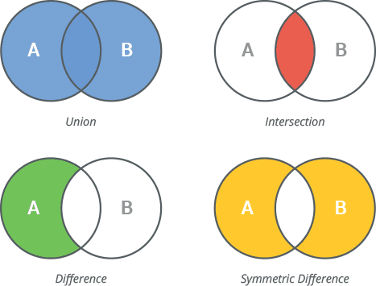
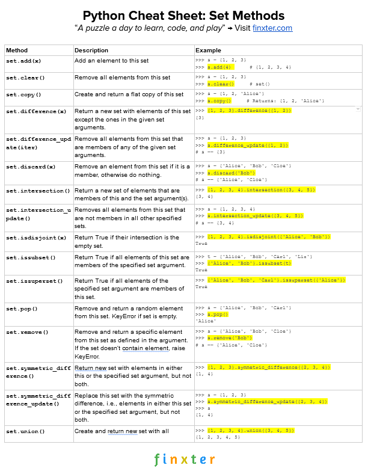

# Sets


### What is Set?

Set is a data type in python used to store several items in a single variable. It is one of the four built-in data types (List, Dictionary, Tuple, and Set) having qualities and usage different from the other three. It is a collection that is written with curly brackets and is both unindexed and unordered.

The main features of sets in Python can be summarized as follows:

1. **Unordered:**&#x53;ets do not maintain a specific order for their elements.

```
my_set = {3, 1, 2}
print(my_set)  # Output: {1, 2, 3} (order may vary)
```

2. **No Duplicate Elements:**&#x53;ets automatically eliminate duplicate values, ensuring each element is unique.

```
my_set = {1, 2, 2, 3}
print(my_set)  # Output: {1, 2, 3}

```

3.  **Mutable:**&#x20;

    * Set elements must be immutable (e.g., numbers, strings, tuples).
    * Mutable objects like lists and dictionaries cannot be set elements.


4. **No Indexing or Slicing:**&#x20;
   * Sets do not support indexing or slicing since they are unordered.
   * Attempting to access elements by index results in an error.
5. **Supports Mathematical Set Operations:**&#x50;ython sets provide built-in methods for union, intersection, difference, and symmetric difference.
6.

    <figure><figcaption></figcaption></figure>
7. **Efficient Membership Testing:**&#x20;

```
my_set = {1, 2, 3}
print(2 in my_set)  # Output: True

```


### How can we create a set in Python?

In Python, sets can be created using various methods. Below are the main ways to create sets:

1. **Using Curly Braces `{}:`**&#x54;he most straightforward way to create a set is by enclosing elements in curly braces.

```
my_set = {1, 2, 3, 4}
print(my_set)  # Output: {1, 2, 3, 4}
```

2. **Using the `set()` Constructor:**&#x59;ou can use the `set()` function to create a set, especially from other iterable types (e.g., lists, tuples, strings)

From a list:

```
my_list = [1, 2, 3, 4, 4]
my_set = set(my_list)
print(my_set)  # Output: {1, 2, 3, 4}
```

From a tuple:

```
my_tuple = (1, 2, 3, 3)
my_set = set(my_tuple)
print(my_set)  # Output: {1, 2, 3}
```

From a string (each character becomes an element):

```
empty_set = set()
print(empty_set)  # Output: set()
print(type(empty_set))  # Output: <class 'set'>
```

3. **Creating an Empty Set:**
   * You **cannot** create an empty set using `{}` because that creates an empty dictionary.
   * To create an empty set, use the `set()` function:

```
empty_set = set()
print(empty_set)  # Output: set()
print(type(empty_set))  # Output: <class 'set'>
```

4. **Creating a Set with Mixed Data Types:**&#x41; set can contain elements of different immutable data types, such as integers, strings, and tuples.

```
mixed_set = {1, "Python", (3, 4)}
print(mixed_set)  # Output: {1, 'Python', (3, 4)}
```

5. **Using a Comprehension to Create a Set:**&#x53;et comprehensions are a concise way to create sets based on existing iterables, with conditions or transformations.

```
squares = {x**2 for x in range(5)}
print(squares)  # Output: {0, 1, 4, 9, 16}
```

**Important Notes:**

1. **Duplicate Removal**:Any duplicate elements are automatically removed when creating a set.

```
my_set = {1, 2, 2, 3}
print(my_set)  # Output: {1, 2, 3}
```

2. **Immutable Elements**:
   * Sets can only contain immutable (hashable) elements like integers, strings, and tuples.
   * Lists, dictionaries, or other sets cannot be elements of a set.

```
invalid_set = {1, [2, 3]}  # Raises TypeError
```


### What is the set methods in Python?

Python provides several built-in methods to work with sets. These methods help in performing various operations such as adding elements, removing elements, and performing mathematical set operations. Below is a comprehensive list of Python set methods:

1. **Adding Elements:**

**add():**&#x41;dds a single element to the set.

```
my_set = {1, 2, 3}
my_set.add(4)
print(my_set)  # Output: {1, 2, 3, 4}
```

**update():**&#x41;dds multiple elements (from an iterable like list, tuple, or another set) to the set.

```
my_set = {1, 2}
my_set.update([3, 4, 5])
print(my_set)  # Output: {1, 2, 3, 4, 5}
```

2. **Removing Elements:**

**remove()**:Removes a specific element from the set. Raises a `KeyError` if the element is not found.

```
my_set = {1, 2, 3}
my_set.remove(2)
print(my_set)  # Output: {1, 3}
```

**discard():**&#x52;emoves a specific element from the set. Does not raise an error if the element is not found.

```
my_set = {1, 2, 3}
my_set.discard(4)  # No error
print(my_set)  # Output: {1, 2, 3}
```

**pop():** Removes and returns an arbitrary element from the set. Raises a `KeyError` if the set is empty.

```
my_set = {1, 2, 3}
element = my_set.pop()
print(element)  # Output: 1 (or another random element)
print(my_set)   # Output: {2, 3}
```

**clear():**&#x52;emoves all elements from the set, making it empty.

```
my_set = {1, 2, 3}
my_set.clear()
print(my_set)  # Output: set()
```

3. **Set Operations:**

**`union()` / `|`**&#x20;

Returns a new set with elements from both sets.

```
set1 = {1, 2, 3}
set2 = {3, 4, 5}
print(set1.union(set2))  # Output: {1, 2, 3, 4, 5}
print(set1 | set2)       # Output: {1, 2, 3, 4, 5}
```

**`intersection()` / `&`**

Returns a new set with common elements from both sets.

```
set1 = {1, 2, 3}
set2 = {3, 4, 5}
print(set1.intersection(set2))  # Output: {3}
print(set1 & set2)              # Output: {3}
```

**`difference()` / `-`**

Returns a new set with elements in the first set but not in the second.

```
set1 = {1, 2, 3}
set2 = {3, 4, 5}
print(set1.difference(set2))  # Output: {1, 2}
print(set1 - set2)            # Output: {1, 2}
```

**`symmetric_difference()` / `^`**

Returns a new set with elements in either set but not both.

```
set1 = {1, 2, 3}
set2 = {3, 4, 5}
print(set1.symmetric_difference(set2))  # Output: {1, 2, 4, 5}
print(set1 ^ set2)                      # Output: {1, 2, 4, 5}
```

4. **Subset and Superser Checks:**

**issubset():**&#x52;eturns `True` if all elements of the set are in another set.

```
set1 = {1, 2}
set2 = {1, 2, 3}
print(set1.issubset(set2))  # Output: True
```

**issuperset():**&#x52;eturns `True` if all elements of another set are in the current set.

```
set1 = {1, 2, 3}
set2 = {1, 2}
print(set1.issuperset(set2))  # Output: True
```

**isdisjoint():**&#x52;eturns `True` if the sets have no elements in common.

```
set1 = {1, 2}
set2 = {3, 4}
print(set1.isdisjoint(set2))  # Output: True
```

5. **Copying a Set:**

**copy():**&#x52;eturns a shallow copy of the set.

```
set1 = {1, 2, 3}
set_copy = set1.copy()
print(set_copy)  # Output: {1, 2, 3}
```

6. **Set Comprehensions:**

While not a method, Python allows set comprehensions for creating sets in a concise way.

```
squares = {x**2 for x in range(5)}
print(squares)  # Output: {0, 1, 4, 9, 16}
```

**How can I check if an element is in a set?**

To check whether an element exists in a set, you can use the **`in`** keyword in Python. This is a fast and efficient operation due to the hash-based structure of sets.

```
my_set = {1, 2, 3, 4, 5}

# Check if 3 is in the set
print(3 in my_set)  # Output: True

# Check if 10 is in the set
print(10 in my_set)  # Output: False
```

```
my_set = {1, 2, 3, 4, 5}

# Check if 6 is not in the set
print(6 not in my_set)  # Output: True

# Check if 2 is not in the set
print(2 not in my_set)  # Output: False
```

Key Points:

* **Efficiency**: Membership checks (`in` or `not in`) for sets are very fast because sets are implemented as hash tables.
* **Immutable Elements Only**: Remember, set elements must be immutable (e.g., numbers, strings, tuples). If you try to check for a mutable object like a list, it will raise an error.

Example of an error with mutable types:

```
my_set = {1, 2, 3}
# print([1, 2] in my_set)  # Raises TypeError: unhashable type: 'list'
```

For checking if an immutable tuple exists:

```
my_set = {(1, 2), (3, 4), (5, 6)}
print((1, 2) in my_set)  # Output: True
print((7, 8) in my_set)  # Output: False

```


<figure><figcaption></figcaption></figure>


